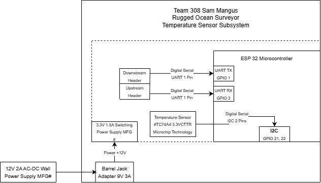

## Overview
My subsystem for the project will be responsible for sensing water temperature in celsius, all component will run off a 3.3V power supply and will transmit the data to our Human Machine Interface(HMI) via UART that will be displayed to the user.

## Temperature Sensor Block Diagram 

## Download

The diagram is also available for download as a [PDF](EGR314.drawio.pdf) and a [Draw.io](https://viewer.diagrams.net/?tags=%7B%7D&lightbox=1&highlight=0000ff&edit=_blank&layers=1&nav=1&title=EGR314.drawio&dark=auto#R%3Cmxfile%3E%3Cdiagram%20name%3D%22Page-1%22%20id%3D%229BCyGVqLNq34ngKyrVn1%22%3E7Z1fd6I6EMA%2FjY%2F1AAHUR2t3u3vP9mxP9d5tH6mkyi6KBay6n%2F4mQhQC8jeJaOlLJYQAmV8mmckkdMBosb13jdX8wTGh3VEkc9sBdx1FkTWph%2F7hlF2QoutykDBzLTPMdEwYW39hmCiFqWvLhF4so%2B84tm%2Bt4olTZ7mEUz%2BWZrius4lne3Ps%2BF1XxgwmEsZTw06m%2FrJMfx6k9jXpmP4NWrM5ubMshWcWBskcJnhzw3Q2kSTwpQNGruP4wa%2FFdgRtXHmkXoLrvp44e3gwFy79IhfMt8p6%2BNZ7f329f%2F%2F93Pv2uOmpN0pQCjQTtXAsNkzy%2FB2pFLg0h7hu0dHSWaLE27m%2FsNGRjH66znppQnxTCR0F134Y9jq89vDmCBnoLKDv7lCGeaQOSd260DZ86yP%2BYJujEEg%2BIxTx7FDc4Q6PjoXeQpFCHJVeeAmBUaGK8Jy1O4XhVdG6zClI0amCfMOdQT9REPoRee1j0l5UJcQGWrFVEVtPzSmIs9jUTy22RCOpKjbRrU27ZrGhZzR2kQwrXItevWZ0KYLVr1mwidrWQLy2Aav2mCiIs9h61yy20%2B2xmFTVnkbVeVBisas1tSITuXBxZqLfMnEUhq6mS1UwE7SeSBTEmQliQ2Yz4MOtHxf8Zm75cLwypjjHBtm1KM3zXecPHDm24x5hebNsm0oybGu2RIdTdEeI0m8%2FoOtbyJ4chicWlmniW%2Bfjpdv4ud6cfZUeH1h%2FXzvkxI23N5iHKIMsrbb7csh59GuG%2F38ZP6LTABf%2FYE1dB1nK6F1sGz1deAtUucFdggvCR0HPDbeRSstmnTATwVomXBOu9BwVEeU%2BxkJpwcvXrA3yde%2BgqhLv5RTEu8Eqn6jB9k%2B013%2BHTxN0evJ8snkGyab1QSfVvfX94%2FefWJXk3Bklx27ORl2olLbIg5qdtijjTdm3pAIIV1MrcGv5z5HfL2Eu%2FPtuGzlxtyMHSJnvnkk2fPASPThetD%2FaxeANWnOBl2mIntMleqhbUc%2FpGlWQYD%2BQXMYRJIY4uSZxUktco4nT256V9KxP5%2BtZQRN7VhVw61kHLPWcfk09q95sPVfVgkjoOcEmP1GrDSKuKT1rSxwf4sr4GsTrOKkl7oKJe5lrP%2F6Vvr6777f35uoO%2Fn6xbm8K%2BbKufSi3Qo8OjYX4kdw3aJgZrlNm4zglOY7T4%2BM4oKrd%2FoD9UC4VutYzB27vnM3y2rFTq2DHxDeXil1F11yW3qzZt3YlSY2O6LpA0rL7WHTwCF0LVQimOMu2IGVl9L37I7q4ZIecVQEN6Y9VkFRfA61al6z2k2WpVFmce%2BXPFduV1vdoFYWXqlDECo97hJfYofllRCmAZKMlci8WqJAKjtodRP%2FUigpFKl00Z0S5x6odgJO6g36f6pcA%2BDz9UproL7df%2BqTBcmV6G1WpKt4kKomyeDsDWm8AuAVd8B86LXc1nGu8sfzp3FrOxFtpj84GG2nSeL1a2RjMh6%2F3JW02bs%2FWUQTMPqWYj4O4%2BXg4JkGBEi%2FbkcwlszEeL2j4l9%2FhNqzHlXOQKKyPqQhDlX4W3sqYqbviXMRJUeLKz3e2xIkkrmIkkSDixMywt8SJJK6Mr0QMcXJ5HdcSd0HEtbFr4HYCFyvoGv7ahdi%2BgEsPPa5w%2BwbZEJNRTx2qN9jkGk0mT02xboKlLXNrhfJM4HS%2BRPKc7fgbPFquwaNKWrz59LkZPGV8Pbmq%2BUJDUTJfpimqmVpno9HT9oUX7CiUaqbZ4q2ayyy7FENc8XC760TiMId6LiQqxvwKUkLntEgapoR0VkpIPq8Sqhrz26xuj4vXpSWOD3HgNGBXZ5GcXFhOCnolCd%2BVUWRk%2FZoy2ha72gbLZIT%2FK%2FztgJRlN1TcnE6N1Q4Qs4%2FVZOkUJKxfhR1AXqYhCpHd7it9SiHyW7ifXq8snYLsiTvjoK8ljhNxZeKhOBNXSWNVtVdb4s5FHKtIKtPw5nt45CyqGiVE0GclxDwaeAuRqcOKnbTLj5MazUfCICu8sS4VHQRE81HGe3VljTy37ivvDylYiETHfG7z%2FNZw3f1m7P8Y0z%2Fo39A0Vv4%2BOnGAgyXxxey2f0uJ%2Bwv3oTzS1evGPdMat4kw8JmCYk8CICtYzgrOMxzd3GFPyC9jX3npYaqnw0PZACETh8eWOubPg8Kw1yfa5SrMU%2FIyDemCAIWEXjVmBdCuZsExK4BlJOjZiIvNSTBywbXEcSKOpdO3JnG1HCJlTaCLI47ah0Srug372Ylj6fQ9J3HMXXBNI%2B5qdBzLADdQxIy%2FlIkt8jJNIY6OZqr6hRCVDnCjN%2BDkTRxLf%2BHZiOMRW9Iw4mT6G1H07HphDyQ9Tc%2FvQxbp9coyfo49cee0VVvi%2BOxcwzJ%2Bjg1x4vfMbIkTSVzFPTMrEDe1Dc%2BzpmWhk7rZm3o1i4sBIy5o0zRhKPDmQmHJRaZFWYKLIwvMZmVTGSgxU0dPx9PMFBY4oKZkBM%2FUqaGbNPx6r%2FFKJJUyg5dJTFTICJ4fxiu0sUChZ%2F0NS5Xisi41ZZMiVrYbhnSUYLqm3gRMYaxqzaaoZTyNlRtfug%2B6m7c%2FopgGmFjThzcVqtYEE7vxJ4vi3Qi1uo1QPW8j9FbGsk4jvLNmlm%2FgehpD18I%2FDs0wKDo3YL3uE4RfpkAcSo%2FWMuf%2BFaPVBSmH2lFy16ccJLXb0xlph5SyeKuHfl310GvVQ6seQhZYercYhW2XmuUu7xPrFPM1NC1sm%2FbgVzUxEsueBNuUWhlfQwNdCOU6o9Jfj6Zn9CQtU5p0fhKEXzZov%2FC3NeL5O9kbAtNr38nb1P7ER2KtHm9olZp9rpZC9CXZxRl9rqA1pN%2BDpaNBl%2BvxWUAqps%2FVLnm18mT%2FtQ0JSH3Mwv73g7Gcrb0U0T%2BtZzNUkiL9nML9gGu8dj%2FgLrZRUvZuROm7LKFyXr2d58NFTXnnfTCbKMvD5HdcnSkVAmTRoetgsI%2FqCUly%2FuCYWBF8%2BR8%3D%3C%2Fdiagram%3E%3C%2Fmxfile%3E) file