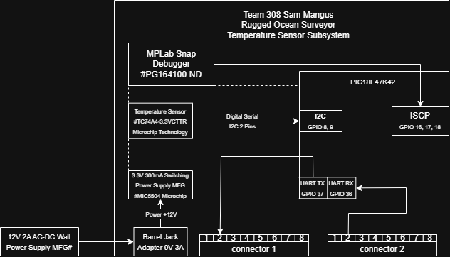

## Overview
My subsystem for the project will be responsible for sensing water temperature in celsius, all components will run off a 3.3V power supply and will transmit the data to our Human Machine Interface(HMI) via UART that will be displayed to the user via an OLED display.

## Temperature Sensor Block Diagram 

## Download

The diagram is also available for download as a [PDF](EGR314blockdia.pdf) and a [Draw.io](https://viewer.diagrams.net/?tags=%7B%7D&lightbox=1&highlight=0000ff&edit=_blank&layers=1&nav=1&title=EGR314.drawio&dark=auto#R%3Cmxfile%3E%3Cdiagram%20name%3D%22Page-1%22%20id%3D%229BCyGVqLNq34ngKyrVn1%22%3E7V3dl6K4Ev9rPOfeh%2FZAwuejbW%2F39t7tGc90752Zp3tQ0soOgg3YrfvX34QPlYAImES09UUJIUDVrypVlarYg8P56iGwFrMn30ZuD0j2qgfvegDIwJDxF2lZJy2qBpKGaeDYaadtw7PzD0obpbR16dgozHWMfN%2BNnEW%2BceJ7HppEuTYrCPyPfLdX383fdWFNUaHheWK5xdbvjh3NklZDlbbtvyNnOsvuLEvpmbmVdU4bwpll%2Bx87TfC3HhwGvh8lv%2BarIXIJ8TK6JNfd7zm7ebAAeVGdC2YrsBy86m%2Fj8cPb3z%2F030cfunKTMgPZBSpsh02bwmidEQV59oDQFh95vocbb2fR3MVHMv4Z%2BEvPRuSmEj5Krn233GV67ebNMWSQP0dRsMYdZjs0zGgbINeKnPf8g31smZD1s1IWTzfDbe4w8h38FkBK4Qj09JIUjBqghgj9ZTBB6VW7tDwwENCogSIrmKKoMBD%2BsfPa26aYVQ3YBq9sa8M2XTkwEGe2KZ%2BabQUhacs20dKmXjLb8DNa650OC0LF8DgxOhfGapfM2AK1VZinNmQlj4WBOLNNv2S27ZfHelxVdJWieTJivatVpSUmDoKLMyaMKya2zNCUcq4KxgStJwoDccZE5kNWYyBCqyjP%2BI%2BZE6HnhTUhPT6wX4vbwijwf6Gh7%2FrBFiyvjutSTZbrTD18OMF3RLj99h0FkYP9yUF6Yu7YNrn1YXhpLnmuVz8m6faBtbeln524CWOHeYA7yNJiFY%2BTnce%2FpuR79DiUjXtF%2F49CxrTm5G28cbhIurhJ1%2FvkNskV6bPgB0erHapVgz0DzQ6u5QzYGbC0AzpiF%2Fg5MDTmvHzJ6qAoscDsQzkva9K2qbEu12oNx1t6wSeSXmOP8P41%2BPaCT7%2F82CuqSbPtvNNNx976YfT4FZ%2BG%2BoFb4%2Bbc3dnoDoVSHfUQzk6BNImwxGJVA8ntNA1aOdGPnd8%2F017k991q58TdOjvwMAl%2BZN3Iwc%2Fdg%2B1F8dE6h%2BFEqGu8TGdUn1IABjhC9emF4RRdvOprEigSgz75SPRJV%2FSdDfq068SbTbzfTjjxap2YeOvZguwmXpOl6tMuaeLVOqX6NImKO5ktowSaSg0kOEqQBa87hLiuTLZXxPFBXJPohHgdJ10Rd8aI%2BzlT%2F%2FxLun8L3m4f7MUd%2Bvunc7uJh31qkw724X%2BJXSVJc9Lt%2BcOJJjPHm4q38Eb%2BB6YIfoTlYuESOD%2FdPzQ09rg9Ww%2FAp8ehqkoKeS5nEviYSAv%2BpqhSNEXNvCm6Od7YoQzCx%2BXiAtop6ErZOzcFXfkyHVHQinwAEnUVtEItTSj0s%2FBW0C3jjd1CnNQ7yu25Ik4k4lrGGAUhToyjfUWcSMQ1yaMTgzi5uY67Iu6MEHeNZMPbFzRfoMCKlgEiLgfyQvy4wl0e7Fa8DHVloNwQN2z48vKtKw7Pjo8jvaDJzMP8nK75OzxqY4dHkZS%2Bpprbj75fso%2Fzf5pkWB7U1GcaoKp8mY5oaqiqlIKtRkhtxS1R4x5AHm893iS7Uwwe64foPwVgoNFMVfEGTMtVREEK7JTOTccUmMIJj2anFFjbNcZuTahcwjtXPJ4Cj6xKaGwrnMXQkqsw1y0WU1MVs5IXjuUN5UxkahWx43ZzDdNpfChGS3zQ7hvkV21cjo8mRtB5C3njojlAscZoUiBVYGxbhBSK5uiBOCMku%2F2niI%2FtLZC6tYIg3rXkD2vyC38NbGsRxevzZpwvMGBZJlWyzJ0WbG7RpffzxoJKw4JZoAfW0giXDgAZED4D0mcwvLnDpJS%2BWzHxyhM1IGdAyFn8fUUd88cDYGhSZNrlIvzm7GW6YqRQkNDaLtFAaolGFbxEA1kmPpwMcTnPmFGo%2BYo4TohjmfhwJOJaLVW09a%2FODnFU9q3adr%2BSkyOOZeLDKRHXdNHj7BB3MTqO5QIurBMjOJcF3OxluoI4ao80lY4R1V6xpSIaii4YcSyDkSdDHI8Vjo4hTqY3U5RbIg6AA9Mzb8SxXONlj7hT%2BqpXxHFBXBaq6RDixFeKXhEnEnEtK0VbIG7iWmHoTJqCTuqrbUIkyVUXFySRTUbAo33fgifCG3iAJfAqXdYGwNuCjdmacikGGuxxTCcT0JipzXBIrfkITiZQ0jhsuo%2B%2BNc44VbJEWImYXSZj8PxpjZFLGIpC5590VCnP60ZrQiVsZVuT2wPJetBxKzy1YXXUco0K9wtl55fvXpA175FybOw5Ss%2Fx7yfLmy7Dklz%2Fb8vpFI8EpK8TZHmk%2FzJ4R%2BtcIUN1tUB5FQQeZxyuwwjN%2BW6qI2dqYuOt56UdsFjRu%2FkysW4n1nf9QX34Y%2FTl%2Fevwf9FNrQXePKfK0LErrmWKlcWyJ0UjjS4eoudSZjQCZyxFj8%2FDUUVxTLiIxeXYvahIliZZFieFIfG3sSMvyT1E7E2lUQjRaYSonBCidFSKDtOosD04Nxqp9Q2IEkfknEyFO2fqRJYbzyOBQ36IrqZ7jKWQvN7I8cID928pi%2FsCy0oFgPbly%2BVG2OR8ZyP4r68hOtaqLcWk0VG51UpMBJAX3IPZo8wE1zzj6e9phLUGEUQP3x9Id2hMLMWgVPTg6EHWsBUh3Xy54ztPmfmMPigBKqNv4%2B2xt%2FdaxiirxOdEAaNtjKhdpLLKHj6PNGWdigJBtUmaskKbR23TlPc9BofYRDnPwDGmxRRjcsHN3JJV0DflvLjT%2B1TRu8axE%2FYS%2F7%2BSgm1nPVo9j%2F0o8udlCjnlUexcyzyIzJ6IJZtEcCFifnJ0yRvf2Fbw6189Eu4ln9i5gvfx59%2FlM%2Bc0sGwHPyfVXOBDO9qbfTP3MYqsMPuyDHVu05cuiBkFgrXTCE0JthJDxRK7VwwVoUgqQqO%2FrZ5gT8QSu1gMERWRRFT1PlRkoGyu40TOsslaDDlVkeTUtb6i8oJkmS0vhoaaSBqaal%2FVDG6Cnal68VTUhc4xstLXjB3BNnjRU5QVWqCnIZSeEPZ1UyO7oSUfXgZppv%2FPxN1R6RRWbu5OpskPAi2joFh3hwuR2ROxrrtzLBGv7k4NZtR1d45lRoFgl%2BTugLruDnMqXpC7A%2Bq6O8yJeJHuTtnWCmLIeTnuTtnuBGJoeEnuTlbTL56Kl%2BnuwLruDnN6Xqa706geu%2FVKJLM09Kr8oI5koRd2sIItF%2F5UeiDateO88AdLHL6zSU1gtj1NNtA4l%2F2zyV8Yl%2BT7iP2nSiNJCjRP8n%2BVJ8t3a1tj3eJPejmVSPBOtdBLZKKzuRaqks9SU%2FJbwh0uuG60hRy9AV2hXLv%2BXwZTA%2FHbZLBcClrWfVeGQ04jBfnCyBamQQf%2F0rCxFJh5KcgKHvf%2BsSFd%2F9S0f2okC5YauraAXV0nPgx8Mkluu2P7Y%2Fbk2yS3%2Bbf%2FAw%3D%3D%3C%2Fdiagram%3E%3C%2Fmxfile%3E) 