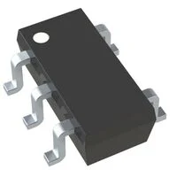
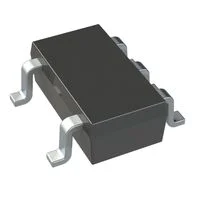
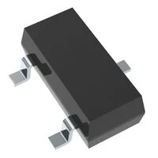

## Module's Selected Major Components

The following sections are the selected major components necessary for my subsystem that will be used to detect the temperature of water and then communicate that information to our control board.

### Power Management

I will proceed with option 3 for now because the other 2 regulators only offer 300 mA of output current which could potentially cause problems down the line if I need to add any other components to my subsystem the current draw could potentially exceed 300 mA.

### Sensor

I will move forward with the first option given it's output is available as an 8-bit digital word and interfaces with I2C, while it is the most expensive of the three it has the highest temperature detection range and is more versatile than the other 2 and offers the highest accuracy. 

### Component Selection

**Voltage Regulator**

1. MIC5501-3.0YM5-TR

    

    * $0.12/each
    * [link to product](https://www.digikey.com/en/products/detail/microchip-technology/MIC5501-3-0YM5-TR/5277873)

    | Pros                                      | Cons                                                             |
    | ----------------------------------------- | ---------------------------------------------------------------- |
    | Inexpensive                               | Higher output voltage variance                                   |
    | Small footprint                           | More difficult to surface mount                                  |

2. MIC5504-3.3YM5-TR

    

    * $0.16/each
    * [link to product](https://www.digikey.com/en/products/detail/microchip-technology/MIC5504-3-3YM5-TR/4864018)

    | Pros                                      | Cons                                                             |
    | ----------------------------------------- | ---------------------------------------------------------------- |
    | Inexpensive                               | Low output current                                               |
    | Easy to surface mount                     | Limited input voltage of 6V                                      |
    
3. AP2112K-3.3TRG1

    

    * $0.22/each
    * [link to product](https://www.digikey.com/en/products/detail/diodes-incorporated/AP2112K-3-3TRG1/4470746)

    | Pros                                      | Cons                                                             |
    | ----------------------------------------- | ---------------------------------------------------------------- |
    | Output current of 600 mA                  | No over voltage protection                                       |
    | -40 to +85 Celsius operating range        | Limited input voltage of 6V                                      |

**Temperature Sensor**

1. TC74A4-3.3VCTTR

    

    * $1.15/each
    * [link to product](https://www.digikey.com/en/products/detail/microchip-technology/TC74A4-3-3VCTTR/443268)

    | Pros                                      | Cons                                                             |
    | ----------------------------------------- | ---------------------------------------------------------------- |
    | Data is output as an 8-bit digital word   | Most expensive                                                   |
    | I2C communication                         | Outputs 3V possibly too low for my needs                         |
    | Meets surface mount constraint of project |

2. TMP235A4DBZR

    
    * $0.36/each
    * [link to product](https://www.digikey.com/en/products/detail/texas-instruments/TMP235A4DBZR/9649794?_gl=1*1k6yvko*_up*MQ..*_gs*Nw..&gclid=398fcc593c8d13f28ddea5d692e6e634&gclsrc=3p.ds)

    | Pros                                      | Cons                                                             |
    | ----------------------------------------- | ---------------------------------------------------------------- |
    | Simple design                             | Analog output                                                    |
    | Small footprint                           | Doesn't meet project requirements for sensing types              |
    | Easy to surface mount only 3 legs         |

3. MCP9701T-E/TT

    

    * $0.40/each
    * [link to product](https://www.digikey.com/en/products/detail/microchip-technology/MCP9701T-E-TT/1987445?_gl=1*1k6yvko*_up*MQ..*_gs*Nw..&gclid=398fcc593c8d13f28ddea5d692e6e634&gclsrc=3p.ds)

    | Pros                                      | Cons                                                             |
    | ----------------------------------------- | ---------------------------------------------------------------- |
    | Up to 6V input                            | Lowest temperature sensing range                                 |
    | Low operating current 6mA                 | Output only available as an analog signal                        |

