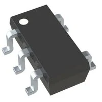
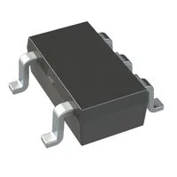
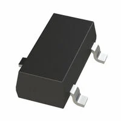
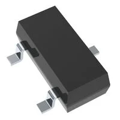
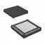
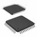
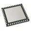

## Module's Selected Major Components

The following sections are the selected major components necessary for my subsystem that will be used to detect the temperature of water and then communicate that information to our control board.

### Power Management

I will proceed with option 1 due to it's higher voltage input availability and it meeting the requirements of being a switching regulator although it is the most expensive of the three and will be the most difficult to solder due to it having pads instead of leads the pro's still outweigh the cones

### Sensor

I will move forward with the first option given it's output is available as an 8-bit digital word and interfaces with I2C, while it is the most expensive of the three it has the highest temperature detection range and is more versatile than the other 2 and offers the highest accuracy. 

### Microcontroller 

I will move forward with option 2 due to it having all the required I2C and ISCP support while also offering leads on the pins which will make it significantly easier to solder and debug as opposed to the other options and it is a commonly used chip in other project so theres many applications I can find to help support my design.

### Component Selection

**Voltage Regulator**

1. MIC23050-SYML-TR

    

    * $0.53/each
    * [link to product](https://www.digikey.com/en/products/detail/microchip-technology/MIC23050-SYML-TR/1980888)

    | Pros                                      | Cons                                                             |
    | ----------------------------------------- | ---------------------------------------------------------------- |
    | Switching regulator                       | Difficult for smd                                                |
    | Small footprint                           | More expensive                                                   |

2. MIC5504-3.3YM5-TR

    

    * $0.16/each
    * [link to product](https://www.digikey.com/en/products/detail/microchip-technology/MIC5504-3-3YM5-TR/4864018)

    | Pros                                      | Cons                                                             |
    | ----------------------------------------- | ---------------------------------------------------------------- |
    | Inexpensive                               | Low output current                                               |
    | Easy to surface mount                     | Limited input voltage of 6V                                      |
    
3. AP2112K-3.3TRG1

    

    * $0.22/each
    * [link to product](https://www.digikey.com/en/products/detail/diodes-incorporated/AP2112K-3-3TRG1/4470746)

    | Pros                                      | Cons                                                             |
    | ----------------------------------------- | ---------------------------------------------------------------- |
    | Output current of 600 mA                  | No over voltage protection                                       |
    | -40 to +85 Celsius operating range        | Non switching doesn't meet requirements                          |

**Temperature Sensor**

1. TC74A4-3.3VCTTR

    

    * $1.15/each
    * [link to product](https://www.digikey.com/en/products/detail/microchip-technology/TC74A4-3-3VCTTR/443268)

    | Pros                                      | Cons                                                             |
    | ----------------------------------------- | ---------------------------------------------------------------- |
    | Data is output as an 8-bit digital word   | Most expensive                                                   |
    | I2C communication                         | Outputs 3V possibly too low for my needs                         |
    | Meets surface mount constraint of project |

2. TMP235A4DBZR

    
    * $0.36/each
    * [link to product](https://www.digikey.com/en/products/detail/texas-instruments/TMP235A4DBZR/9649794?_gl=1*1k6yvko*_up*MQ..*_gs*Nw..&gclid=398fcc593c8d13f28ddea5d692e6e634&gclsrc=3p.ds)

    | Pros                                      | Cons                                                             |
    | ----------------------------------------- | ---------------------------------------------------------------- |
    | Simple design                             | Analog output                                                    |
    | Small footprint                           | Doesn't meet project requirements for sensing types              |
    | Easy to surface mount only 3 legs         |

3. MCP9701T-E/TT

    

    * $0.40/each
    * [link to product](https://www.digikey.com/en/products/detail/microchip-technology/MCP9701T-E-TT/1987445?_gl=1*1k6yvko*_up*MQ..*_gs*Nw..&gclid=398fcc593c8d13f28ddea5d692e6e634&gclsrc=3p.ds)

    | Pros                                      | Cons                                                             |
    | ----------------------------------------- | ---------------------------------------------------------------- |
    | Up to 6V input                            | Lowest temperature sensing range                                 |
    | Low operating current 6mA                 | Output only available as an analog signal                        |

**Microcontroller**

1. PIC18F47K42T-I/MV

    
    * $2.72/each
    * [link to product](https://www.digikey.com/en/products/detail/microchip-technology/PIC18F47K42T-I-MV/7561728)

    | Pros                                      | Cons                                                             |
    | ----------------------------------------- | ---------------------------------------------------------------- |
    | Small footprint                           | Difficult to solder                                              |
    | Less prone to noise                       | Difficult to debug                                               |
    | Meets surface mount constraint of project |

2. PIC18F47K42-I/PT

    
    * $2.79/each
    * [link to product](https://www.digikey.com/en/products/detail/microchip-technology/PIC18F47K42-I-PT/7561733)

    | Pros                                      | Cons                                                             |
    | ----------------------------------------- | ---------------------------------------------------------------- |
    | ICSP and I2C pins                         | Larger footprint                                                 |
    | Easy to solder with exposed pins          | Legs could be damaged easily                                     |
    | Easy to debug                             |

3. PIC18F47K42-E/ML

    

    * $2.86/each
    * [link to product](https://www.digikey.com/en/products/detail/microchip-technology/PIC18F47K42-E-ML/7561744)

    | Pros                                      | Cons                                                             |
    | ----------------------------------------- | ---------------------------------------------------------------- |
    | 40 pin package                            | Most expensive                                                   |
    | Smallest footprint                        | Difficult to solder                                              |
    | High operating temperature range          | 

    ## Final Components

    | Component                                 | Selection                                                        |
    | ----------------------------------------- | ---------------------------------------------------------------- |
    | Microcontroller                           | PIC18F47K42                                                      |
    | Voltage Regulator                         | MIC23050-SYML-TR                                                 |
    | Temperature Sensor                        | TC74A4                                                           |
    