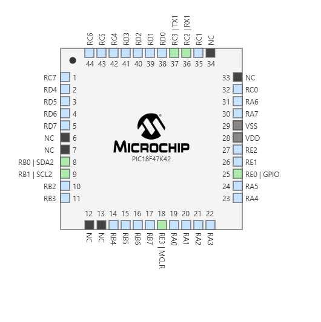

## Subsystem Responsibilities

My subsystem will be responsible for detecting the temperature of water and then conveying the to our control board being operated by Adrian. I will be using a TC74A4-3.3VCTTR temperature sensor that has an operating current of 20 mA, and since I will be using the PIC18F47K42 my subsystem will only need 3.3V and around 50 mA of current to operate safely which allows the rest of my team more flexibility with their designs. We will be communicating via UART and I will be sending to Adrian. 

## Temperature Sensor MPLabX Configuration 

## Pin Functions

RC3 is my TX and will be sending the data to Adrians control board so he can use it to display the information to the user RC2 is my rx and will be used to receive status request and forwards teammates messages down the chain. I will be using RE0 as a GPIO to simply have a debugging LED so I can troubleshoot my code. RB0 and RB1 are my SDA and SCL respectively which will be my I2C communication that will be connect to the associated pins of my temperature sensor so I will be able to detect ambient temperature in celsius. 

## Final Selection

I have decided to proceed with the PIC18F47K42 because of it's minimal current and voltage operating ranges, because my responsibility will only be to send data to Adrian it made sense to go with the PIC as opposed to and ESP32 for example because my subsystem has no use for Wifi/bluetooth. The pic also has the appropriate SCL and SDA pins needed to operate my temperature sensor while leaving many other pins open for the rest of my team to use as some of their systems require more pins because of their communication types. In addition to this the rest of our team is using the ESP32 and per project requirements we needed at least one person to use a PIC and my subsystem made the most sense for that.