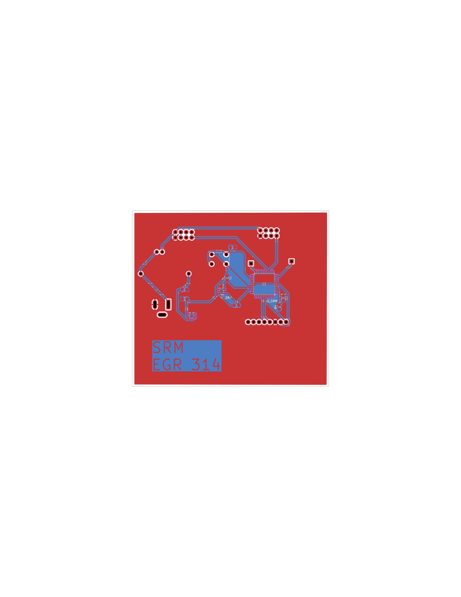
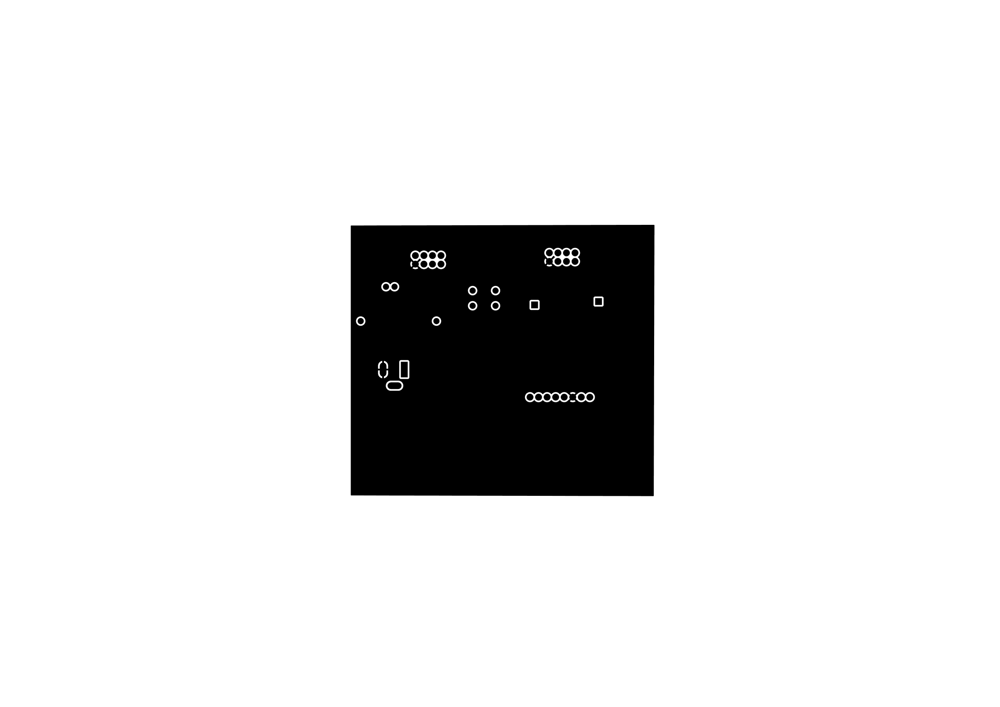
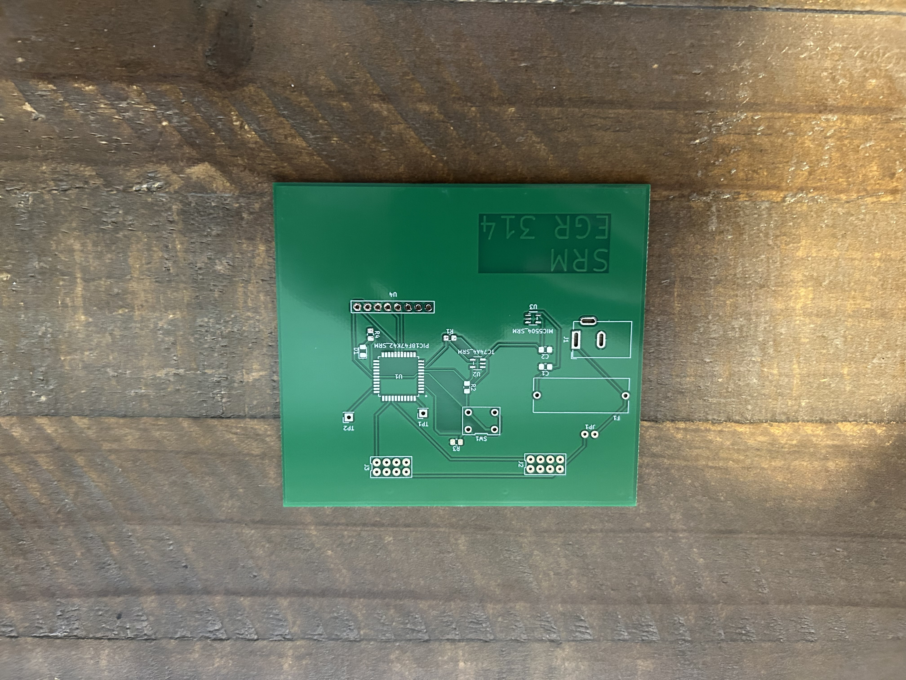
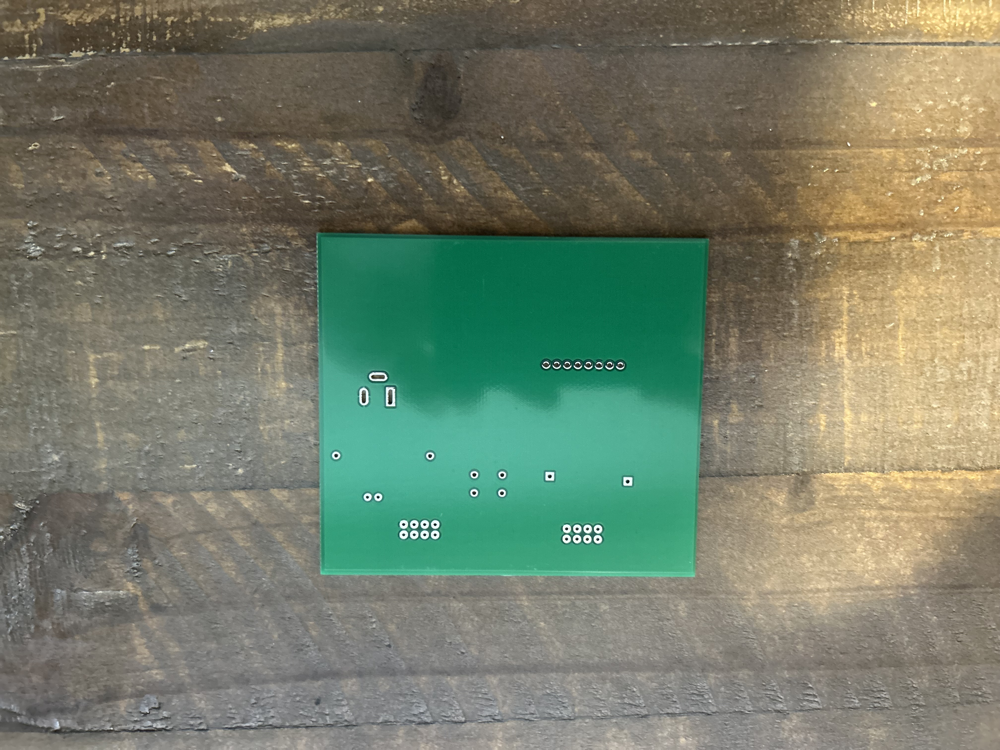
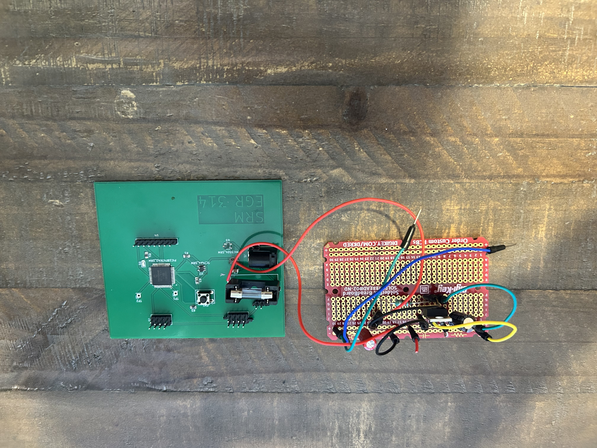
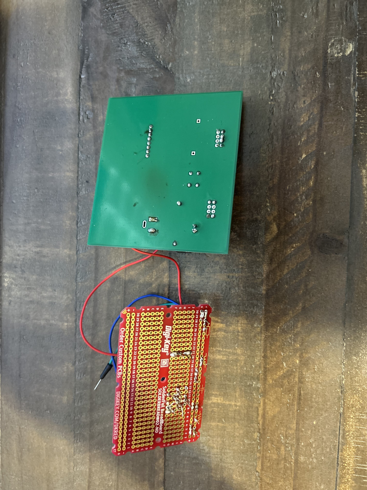

## Overview

This PCB is designed to hold all the components necessary to make my subsystem functional by completing all the electrical connections in my circuit with traces.

{style width:"350" height:"300;"}
**PCB TOP VIEW** 

{style width:"350" height:"300;"}
**PCB BOTTOM VIEW** 

{style width:"350" height:"300;"}
**RAW PCB** 

{style width:"350" height:"300;"}
**RAW PCB** 

{style width:"350" height:"300;"}
**POPULATED PCB** 

{style width:"350" height:"300;"}
**POPULATED PCB** 

## Resources

The Gerber files as a zip download is available [*here*](Mangus.Sam.Gerber.zip), and the Zip folder of the project [*here*](TempSens314.zip).