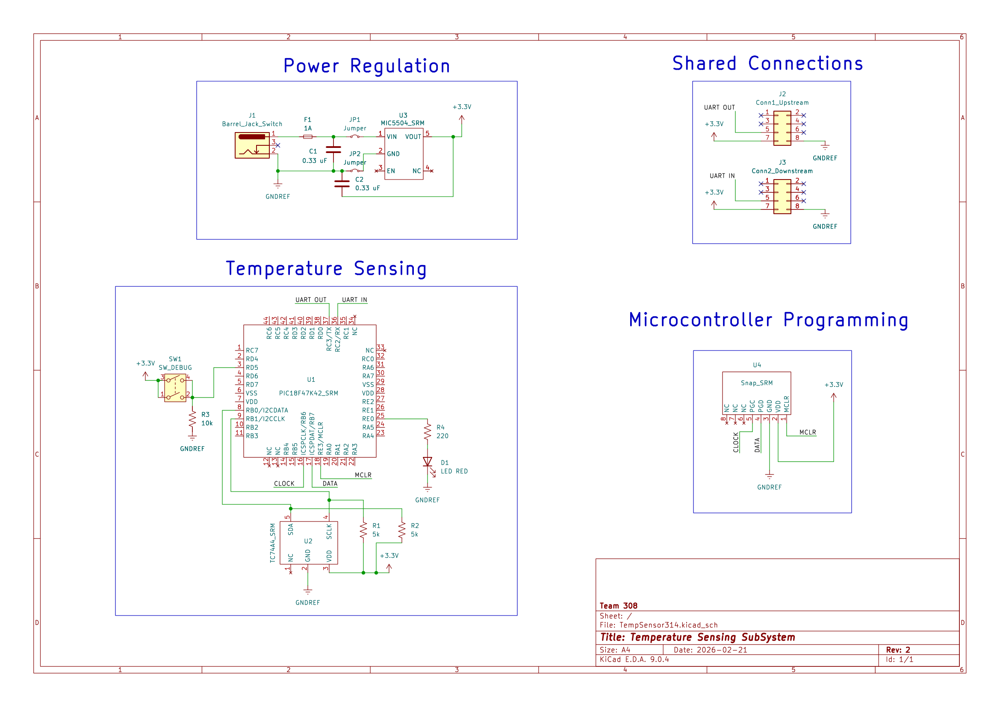

## Overview

This schematic is design to support temperature sensing in celsius by utilizing a TC74A4 and PIC18F47K42 and relay that information via UART and our team connectors to our control board being operated by Adrian.

{style width:"350" height:"300;"}
**Temperature Subsystem** 

## Resources

The schematic as a PDF download is available [*here*](TempSens.pdf), and the Zip folder of the project [*here*](EGR314_Subsystem.zip).